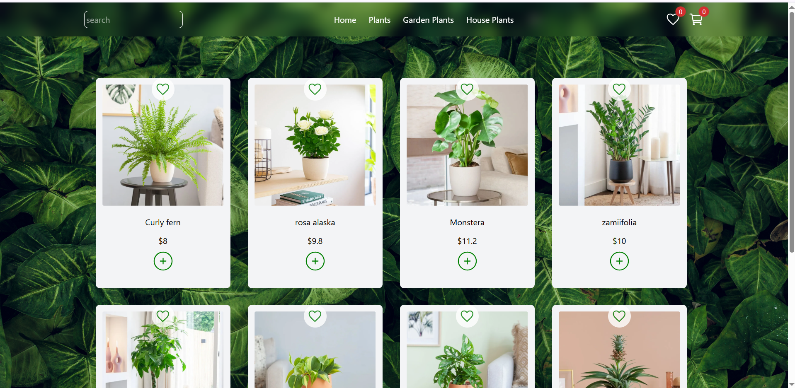
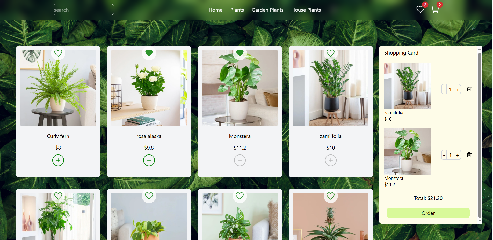
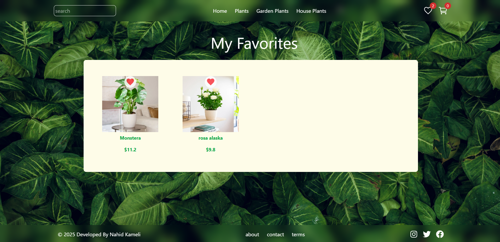

# Plant Shop

A React app for browsing and managing plant products with a shopping cart and favorites.

## Features
- Display products with search functionality
- Add/remove products to/from cart and favorites
- Manage item quantities in the cart
- Responsive for mobile and desktop
- Hamburger menu with Material-UI

## Tech Stack
- React + Vite
- Tailwind CSS
- Material-UI
- React Router

HEAD
=======

## Screenshots





## Installation
1. Clone the repo:
   ```bash
   git clone https://github.com/NahidKameli/plants_shop.git

